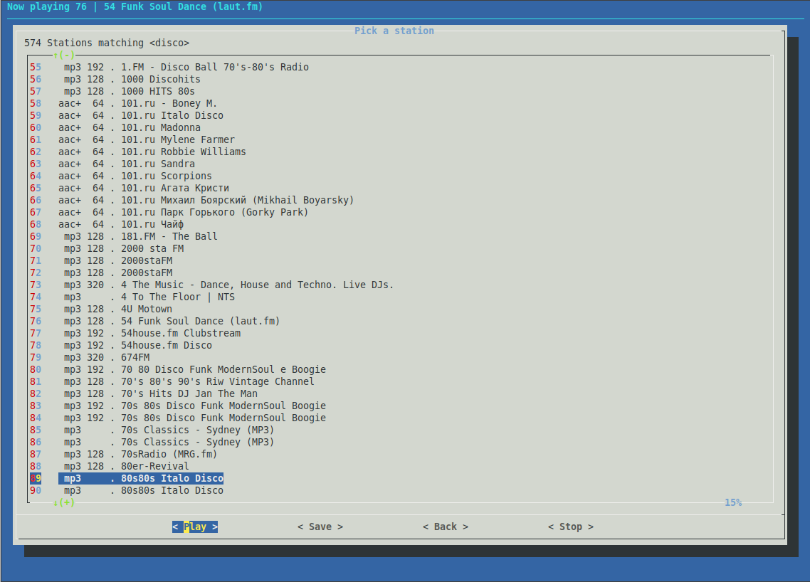

# ziptuner
Internet radio station tuner (playlist fetcher) for the console using C and [dialog](https://invisible-island.net/dialog/).

The ziptuner was originally created to [provide my zipit-z2 mp3 player with a low resource internet radio browser](https://macrofig.blogspot.com/2017/03/back-in-groove.html).  It was a simple tool to help discover interesting internet radio stations from http://www.radio-browser.info and save the playlist URLs.   I eventually added an option to listen first before saving (with the help of a command line player like mpg123).  That option made the ziptuner itself into a minimal, but functional, internet radio player.

There's no installer, except for the one in the openwrt-zipit linux.  So you have to pick the command line stream player(s) yourself and create a script that tells ziptuner about them.  See the example scripts in the github sources for details.  

The vlc example script works great on my regular ride computer.  You just need to compile the ziptuner, and then install the vlc package for your distro along with the curl and dialog packages required to run it.  A curl*-dev package is required to compile the ziptuner executable on most distros.

